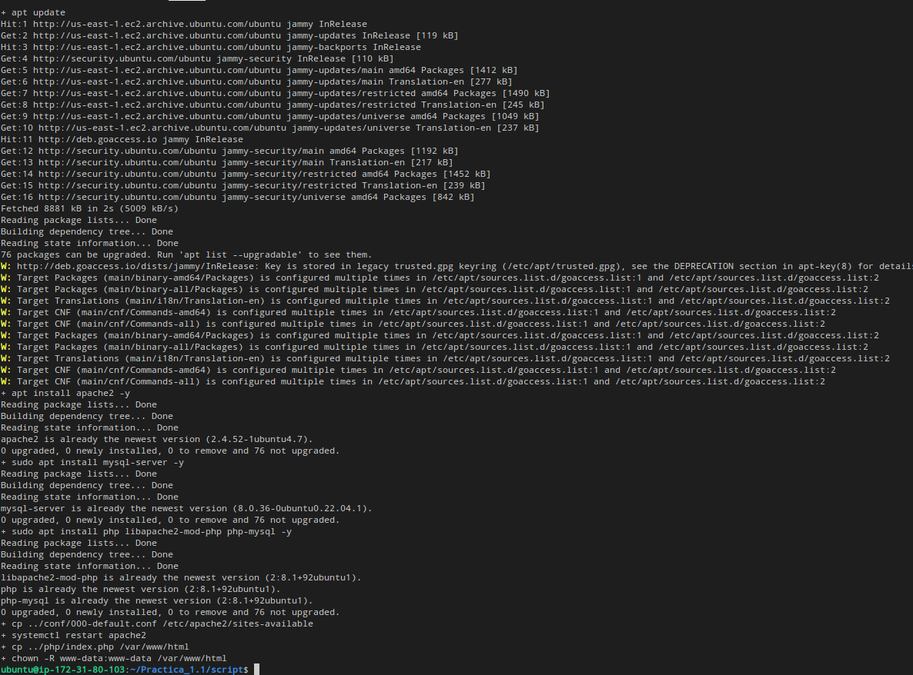

# Instalacion pila LAMP
LAMP es el acrónimo usado para describir un sistema de infraestructura de Internet que usa las siguientes herramientas:

- Linux (Sistema Operativo)
- Apache (Servidor Web)
- MySQL/MariaDB (Sistema Gestor de Bases de Datos)
- PHP (Lenguaje de programación)

Gracias a aws tenemos una maquina ubuntu en la que trabajar por lo que la parte de linux ya esta cubierta. Por eso estaremos trabajando en consola de linux.

## Instalacion Aplicaciones
Siempre que vayamos a instalar algo tenemos que actualizar los paquetes

### Actualizamos los paquetes
```
apt update
``` 

### Actualizamos aplicaciones
```
apt upgrade -y
```

## Instalar Apache
Comando de instalacion Apache `-y` para que no te pida confirmacion.
```
apt install apache2 -y
```


## Instalar MySQL 
Comando de instalacion MySQL `-y` para que no te pida confirmacion. 
```
apt install mysql-server -y
```

## Instalar PhP 
Comando de instalacion de php y los modulos necesarios para conectarlo con Apache y MySQL, el `-y` para que no te pida confirmacion.  
```
apt install php libapache2-mod-php php-mysql -y
```

## Copiar archivo de conf 
Con esto conseguimos que Apache tenga la configuracion que tenemos en el repositorio.  
```
cp ../conf/000-default.conf /etc/apache2/sites-available
```
En la con figuracion tenemos varias cosas interesantes `ServerSignature` y `ServerTokens` sirve para que no salga la version de Apache ni en la cabezera ni al final de la practica.`DirectoryIndex` elegimos el orden en el que Apache va a elegir los index.
```
ServerSignature off
ServerTokens Prod

<VirtualHost *:80>
    #ServerName www.example.com
    DocumentRoot /var/www/html
    DirectoryIndex index.php index.html
    
    ErrorLog ${APACHE_LOG_DIR}/error.log
    CustomLog ${APACHE_LOG_DIR}/access.log combined
  </VirtualHost>
  ```
## Copiar index
Nuestro index.php pasa a estar en la carpeta donde apache mira su html.
```
cp ../php/index.php /var/www/html
```  
## Modificar  propietario de /var/www/html al de apache
Este comando es necesario para que apache funcione correctamente. `www-data` es el usuario de apache y le damos el propietario de la carpeta donde estan nuestros html.
```
chown -R www-data:www-data /var/www/html
```
