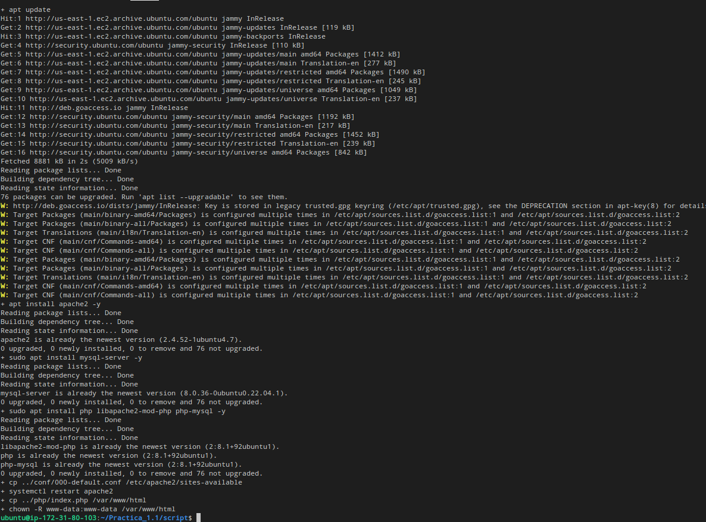

# Practica_1.2
# Instalacion pila LAMP
LAMP es el acrónimo usado para describir un sistema de infraestructura de Internet que usa las siguientes herramientas:

- Linux (Sistema Operativo)
- Apache (Servidor Web)
- MySQL/MariaDB (Sistema Gestor de Bases de Datos)
- PHP (Lenguaje de programación)

Gracias a aws tenemos una maquina RedHat en la que trabajar por lo que la parte de linux ya esta cubierta. Por eso estaremos trabajando en consola de linux.


## Instalacion Aplicaciones
Siempre que vayamos a instalar algo tenemos que actualizar los paquetes

### Actualizamos los paquetes
```bash
dnf update -y
``` 

## Instalar Apache
Comando de instalacion Apache `-y` para que no te pida confirmacion.
```bash
dnf install httpd -y
```
### Iniciamos el servicio apache
```bash
systemctl start httpd
```
### Configuramos para que el servicio inicie automaticamente
```bash
systemctl enable httpd
```
## Instalar MySQL 
Comando de instalacion MySQL `-y` para que no te pida confirmacion. 
```bash
dnf install mysql-server -y
```
### Iniciamos el servicio sql
```bash
systemctl start mysqld
```
### Configuramos para que el servicio inicie automaticamente
```bash
systemctl enable mysqld
```
## Instalar PhP 
Comando de instalacion de php, el `-y` para que no te pida confirmacion.  
```bash
sudo dnf install php -y
```
### Instalamos extension para mysql
```bash
sudo dnf install php-mysqlnd -y
```
### Reiniciamos el servicio apache
```bash
sudo systemctl restart httpd
```
## Copiar info
Nuestro info.php pasa a estar en la carpeta donde apache mira su html.
```bash
cp ../php/info.php /var/www/html
```  
## Modificar  propietario de /var/www/html al de apache
Este comando es necesario para que apache funcione correctamente. `www-data` es el usuario de apache y le damos el propietario de la carpeta donde estan nuestros html.
```bash
chown -R www-data:www-data /var/www/html
```

# Instalacion de Tools
Para que los servicios funcionen correctamente en RedHat tendremos que instalar una serie de herramientas 
## Actualizar paquetes
```bash
dnf update -y
```

## Instalamos modulos php necesarios para phpmyadmin
```bash
dnf install php-mbstring php-zip php-json php-gd php-fpm php-xml -y
```
## Reiniciamos servicio apache
```bash
systemctl restart httpd
```

## Instalamos la utilidad wget
```bash
dnf install wget -y
```

## Eliminamos descargas previas
Esto hara que no se nos acumulen descargas si utilizamos el script varias veces.
```bash
rm -rf /tmp/phpMyAdmin-latest-all-languages.zip
rm -rf /var/www/html/phpmyadmin
```

## Descargamos el codigo fuente de phpmyadmin
```bash
wget https://files.phpmyadmin.net/phpMyAdmin/5.2.1/phpMyAdmin-5.2.1-all-languages.zip -P /tmp
```

## Instalamos la utilidad unzip
```bash
dnf install unzip -y
```

## Descomprimimos el codigo fuente de phpMyadmin en /var/www/html
```bash
unzip -u /tmp/phpMyAdmin-5.2.1-all-languages.zip -d /var/www/html
```

## Renombramos el directorio
```bash
mv /var/www/html/phpMyAdmin-5.2.1-all-languages /var/www/html/phpmyadmin
```

## Cambiamos propietario y el grupo a /var/www/html
```bash
chown -R apache:apache /var/www/html
```

## Creamos archivo de configuracion a partir de el de ejemplo
```bash
cp /var/www/html/phpmyadmin/config.sample.inc.php /var/www/html/phpmyadmin/config.inc.php
```

## Generamos un valor aleatorio de 32 caracteres para la variable blowfish_secret
```bash
RANDOM_VALUE=`openssl rand -hex 16`
```

## Modificamos la variable blowfish_secret en el archivo de configuración
```bash
sed -i "s/\(\$cfg\['blowfish_secret'\] =\).*/\1 '$RANDOM_VALUE';/" /var/www/html/phpmyadmin/config.inc.php
```

## Modificamos la variable blowfish_secret en el archivo de configuración
```bash
sed -i "/blowfish_secrets/a \$cfg\['TempDir'\] = '/tmp';" /var/www/html/phpmytadmin/config.inc.php
```

## Eliminamos la base de datos de php anterior si existe
```bash
mysql -u root <<< "DROP DATABASE IF EXISTS phpmyadmin"
```

## Importamos el script  de creacion de base de datos de phpmyadmin
```bash
mysql -u root < /var/www/html/phpmyadmin/sql/create_tables.sql
```

## Creamos usuario phpmyadmin
```bash
mysql -u root <<< "DROP USER IF EXISTS $PMA_USER@'%'"
mysql -u root <<< "CREATE USER $PMA_USER@'%' IDENTIFIED BY '$PMA_PASS'"
mysql -u root <<< "GRANT ALL PRIVILEGES ON $PMA_DB.* TO $PMA_USER@'%'"
```

